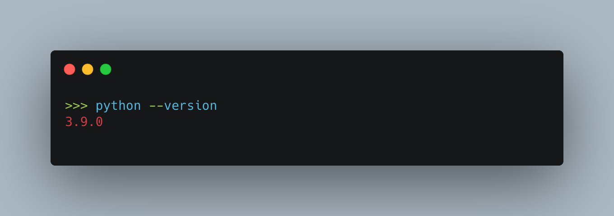

# assignment-1

In this assignment, you will do practices on things we learned so far. You will be practicing:

- Markdown
- Python as a command line application
- Installing packages
- Creating virtual environments

All the best.
